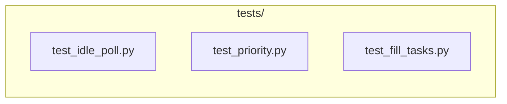

Status: `ready-for-agent`

# Test suite for idle-poll, priority, and fill tasks

## What to build

Add automated tests for the three features in this PRD.

### Test files

### Test 1: Priority claim order (`test_priority.py`)

- Submit tasks with priorities [-1, 0, 5, 10] to a temp SQLite DB
- Run the claim SQL `ORDER BY priority DESC, created_at ASC LIMIT N`
- Verify highest-priority tasks claimed first
- Verify equal-priority tasks claimed oldest-first
- Edge case: tasks with negative priority are claimed only after all 0+ tasks are exhausted

Uses `sqlite3.connect(":memory:")` — no filesystem needed.

### Test 2: Idle-poll loop (`test_idle_poll.py`)

- Create a temp `tasks.db`
- Start the processing loop with IDLE_TIMEOUT=120, POLL_INTERVAL=5
- Verify it sleeps when queue is empty
- Inject a task via a second connection mid-loop
- Verify the task is claimed within POLL_INTERVAL + small tolerance
- Verify idle timer resets after task claim
- Verify loop exits after IDLE_TIMEOUT with no new tasks

### Test 3: Fill task generation (`test_fill_tasks.py`)

- Mock the collectors to return known results (no network calls)
- Call the fill generator with a sample config
- Verify fill tasks are created with priority -1 and type "fill"
- Verify `max_per_job` cap is respected
- Verify fill generation with `enabled: false` produces no tasks

### Test 4: Fill vs real priority (`test_priority.py`)

- Create 5 fill tasks (-1) and 1 urgent task (10)
- Run claim loop with BATCH_SIZE=1
- Verify the urgent task is claimed first (5 iterations of fill claims would happen before)
- Run with BATCH_SIZE=10, verify all tasks claimed, urgent first

### Prior art

The existing test suite (32 tests) tests SQLite queue operations with temp databases. These tests follow the same pattern.

## Acceptance criteria

- [ ] All 4 test scenarios pass
- [ ] Tests use temp DBs — no side effects on production data
- [ ] Priority test verifies ordering mathematically (not by log inspection)
- [ ] Idle-poll test runs in <10 seconds (uses short POLL_INTERVAL)

## Blocked by

- Issue #1 (Idle-poll loop) — tests need the loop to exist
- Issue #2 (Priority claiming) — tests need priority ordering
- Issue #3 (Fill task generation) — tests need fill generator
